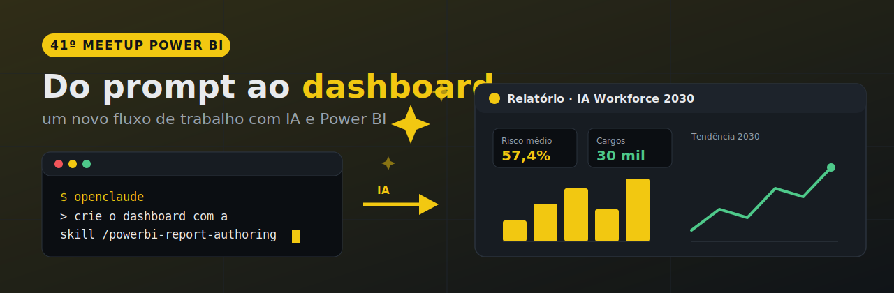

Conteúdo do **41º Meetup Power BI** — *"Do prompt ao dashboard: um novo fluxo de trabalho com IA e Power BI"*. Apresentação da aula + as 5 skills de Power BI / Fabric usadas na demonstração ao vivo.

**▶ Apresentação online: [soutes.github.io/meetup_pbi/apresentacao.html](https://soutes.github.io/meetup_pbi/apresentacao.html)**

## Do que se trata

Uma sessão prática sobre uso de IA generativa no desenvolvimento de dashboards em Power BI. A demonstração constrói um dashboard completo — da definição dos visuais à criação das medidas DAX — usando IA de baixo custo via terminal, integrada ao Power BI Desktop por três peças:

- **Power BI Modeling MCP** (`@microsoft/powerbi-modeling-mcp`, oficial da Microsoft) — expõe o modelo semântico vivo (tabelas, medidas, relacionamentos) direto ao agente de IA.
- **Microsoft Desktop Bridge** — servidor embutido no próprio Power BI Desktop; permite sincronizar edições, tirar screenshot e consultar o status do arquivo aberto, sem clique manual. Recurso nativo, não exige Fabric nem licença adicional.
- **Formato PBIP** — o projeto salvo como pasta de arquivos JSON/TMDL editáveis por script, em vez do `.pbix` binário fechado. É o que torna o ciclo automático possível: editar → validar → recarregar → conferir.

As **skills** entram como a camada de conhecimento: playbooks que ensinam à IA o passo a passo de quem já construiu relatório Power BI centenas de vezes — convenções de PBIR, validação, design e DAX que o modelo sozinho não tem de fábrica.

## Conteúdo do repositório

| Item | O que é |
|---|---|
| [`apresentacao.html`](https://soutes.github.io/meetup_pbi/apresentacao.html) | Slides da aula, direto no navegador — navegue com `←` `→` ou clique; `F` para tela cheia |
| [`skills/`](skills/) | As 5 skills prontas para instalar no Claude Code / OpenClaude |
| [`codes.md`](codes.md) | Todos os comandos e prompts da aula, prontos para copiar e colar |

## As 5 skills

| Skill | O que faz | Gera | Requisitos |
|---|---|---|---|
| `powerbi-report-planning` | O maestro: levanta requisitos, inspeciona o modelo existente, monta o brief e aciona o build | `requirements.md` · `plan.md` | Local (inspeção via Modeling MCP) |
| `powerbi-report-design` | Design antes de qualquer arquivo existir: arquétipo de página, paleta, tipos de gráfico, tema | Brief de design (só documento) | 100% local |
| `powerbi-report-authoring` | Escreve e valida o JSON do relatório (PBIR): páginas, visuais, filtros e tema | PBIR validado | 100% local · Desktop aberto |
| `powerbi-report-management` | Ciclo de vida no workspace: publica, baixa ou apaga relatório via API REST do Fabric | Relatório publicado | Fabric + login `az` |
| `semantic-model-authoring` | Modelo semântico: tabelas, medidas DAX, relacionamentos, refresh — via Modeling MCP | Modelo editado | Desktop aberto ou Fabric |

Escopo importante: a skill de **authoring** trabalha só na camada visual (pasta `.Report`). Quem mexe nos dados e medidas (pasta `.SemanticModel`) é a **semantic-model-authoring** com o Modeling MCP.

## Pré-requisitos

- **Node.js ≥ 22** (npm e npx vêm junto)
- **Power BI Desktop** com um projeto **`.pbip`** aberto (formato de projeto, não `.pbix` — salve como PBIP em Arquivo → Salvar como)
- Conta na **OpenRouter** ou **Claude**
- **OpenClaude CLI** ou **Claude Code CLI** instalado

## Como consumir

### 1. Instalar o CLI (exemplo com OpenClaude)

```bash
npm install -g @gitlawb/openclaude@latest
openclaude --version
```

> OpenClaude é um fork comunitário do Claude Code (não afiliado à Anthropic) e usa os mesmos padrões de configuração. Se você usa o Claude Code oficial, os passos são os mesmos — troque `openclaude` por `claude`.

### 2. Instalar o MCP do Power BI

```bash
openclaude mcp add powerbi-modeling-mcp -- npx -y @microsoft/powerbi-modeling-mcp@latest --start
openclaude mcp list   # deve listar powerbi-modeling-mcp ✓
```

Se já tinha instalado antes (por exemplo pela extensão do VS Code), remova a instalação antiga primeiro para não rodar duas instâncias do servidor.

### 3. Instalar as skills

```bash
git clone https://github.com/soutes/meetup_pbi.git
```

Copie as pastas desejadas de `skills/` para:

- `%USERPROFILE%\.claude\skills\` — global, vale para todas as sessões; **ou**
- `.claude\skills\` dentro do projeto — local, só para aquele projeto.

Reinicie o Claude Code / OpenClaude para carregar.

### 4. Usar

Com o Power BI Desktop aberto num `.pbip`, invoque as skills pelo nome no chat:

```
Use a skill /semantic-model-authoring pra conectar no arquivo .pbip aberto
no Power BI Desktop via powerbi-modeling-mcp. Liste tabelas, colunas,
medidas e relacionamentos do modelo.
```

A partir daí, peça páginas, visuais, medidas DAX e temas em linguagem natural — a skill certa cuida do processo, o MCP executa no modelo vivo, e o Bridge recarrega o Desktop e tira screenshot para conferência. Os dois prompts completos usados na demonstração ao vivo estão nos últimos slides da apresentação.

## Créditos e licença

As skills são derivadas de [microsoft/skills-for-fabric](https://github.com/microsoft/skills-for-fabric), sob licença MIT (veja [LICENSE](LICENSE)).

Apresentação e adaptação: **Luiz Soutes** — [github.com/soutes](https://github.com/soutes) · [linkedin.com/in/soutes](https://linkedin.com/in/soutes)
